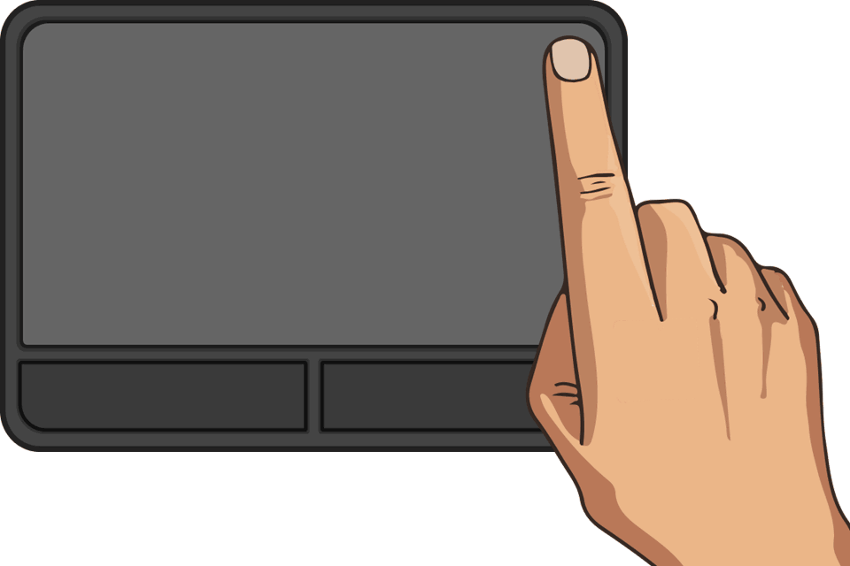

# GyroScroll

### Circular scrolling for Windows 10 and Windows 11 Precision Touchpads

[](https://github.com/rob-vandenberg/gyroscroll/releases)


---

### Please support development
#### Consider a small donation

If GyroScroll improves your daily scrolling experience, please consider donating a small amount to the development of this app.
You are free to choose any amount you like. Any help is greatly appreciated. It helps me to continue work on the app, fixing bugs and adding new features.
Thank you very much in advance!

<br>

[](https://ko-fi.com/gyroscroll)
<br><sup>(Paypal, Apple Pay, Google Pay, Ideal/Wero, Cards)</sup>

---

## What is circular scrolling?

Circular scrolling lets you scroll continuously by moving your finger in a **circle** along the edge of your touchpad — like spinning a wheel. Once you start the circular motion, you can keep going indefinitely without ever lifting your finger.

- **Vertical scrolling** → Move your finger **up or down** along the **right edge** (or **left edge** for left-handed users)
- **Horizontal scrolling** → Move your finger **left or right** along the **bottom edge** 
- **Continuous scrolling** → Keep your finger on the touchpad and move it in a circular motion in either direction for uninterrupted scrolling
- **Reverse direction** → Reverse your direction mid-gesture to change the direction of scrolling



---

## Requirements

- Windows 10 or Windows 11
- A **Windows Precision Touchpad** (WPT) — the built-in touchpad on most modern laptops

> **Not sure if your touchpad qualifies?**  
> Go to *Settings → Devices → Touchpad*. If you see advanced gesture options, like multi-touch gestures, then you almost certainly have a Precision Touchpad.

---

## Installation

GyroScroll is a single portable executable — no installer needed.

1. Download `GyroScroll.exe` from the [Releases](https://github.com/rob-vandenberg/gyroscroll/releases) page
2. Copy it to any folder you like (e.g. `C:\Program Files\GyroScroll\GyroScroll.exe`)
3. Double-click to run — a small icon appears in the system tray

That's it. GyroScroll is now active.

### Run at startup (optional)

To have GyroScroll start automatically with Windows:

1. Open the GyroScroll settings window and enable the option "Start with Windows".

---

## Usage

Once running, GyroScroll works silently in the background.

| Gesture | Action |
|---|---|
| Finger touching the **right edge** (or left edge), moving up/down | Vertical scroll |
| Finger touching the **bottom edge**, moving left/right | Horizontal scroll |
| Continuing in a circle | Continuous scroll |
| Reversing direction | Scroll in opposite direction |

> **Tip:** You don't need to draw a perfect circle. Start at the edge and let your finger flow naturally — the scrolling follows your movement intuitively.

---

## Settings

Right-click the tray icon and choose **Settings** to open the settings window.


### Left-handed operation

By default, GyroScroll uses the **right edge** of the touchpad for vertical scrolling. If you are left-handed and prefer to scroll with your left hand, enable **Left handed operation** to switch to the **left edge** instead. The touchpad preview updates immediately to reflect your choice.

### Edge zones

The coloured areas in the touchpad preview show the active scroll zones.

| Setting | Description |
|---|---|
| **Right edge** / **Left edge** | Width of the vertical scroll zone (1–30). Default: 6 |
| **Bottom edge** | Height of the horizontal scroll zone (1–30). Default: 6 |

Values represent a percentage of the touchpad dimension. A value of 8 means the zone covers 8% of the pad width/height. Increase if the zone feels too narrow to trigger reliably; decrease if it interferes with normal cursor movement.

You can adjust these values by **typing a number** in the box or **dragging the slider**. The touchpad preview updates live as you change the values.

### Scroll speed

| Setting | Description |
|---|---|
| **Vertical** | How fast vertical scrolling responds (1–40). Default: 16 |
| **Horizontal** | How fast horizontal scrolling responds (1–40). Default: 16 |

Higher values = faster scrolling per finger movement. Adjust to taste.

### Sensitivity

The Sensitivity setting controls how responsive GyroScroll is to direction changes while scrolling (1–30). Default: 12.

When you reverse the direction of your finger during a circular motion, GyroScroll needs to see your finger travel a short distance in the new direction before it commits to the change. This prevents accidental direction flips caused by small wobbles or imperfect circular movements.

- **Lower values** make direction changes easier to trigger — a small movement in the opposite direction is enough.
- **Higher values** require a more deliberate reversal before the scroll direction changes.

If you find the scroll direction flipping when you don't intend it to, try a higher value. If it feels sluggish to respond when you intentionally reverse, try a lower one.

### Natural (reversed) scroll

| Setting | Description |
|---|---|
| **Reverse vertical** | Inverts the vertical scroll direction |
| **Reverse horizontal** | Inverts the horizontal scroll direction |

Enable these if you prefer the "natural" scrolling style where content follows your finger rather than the traditional direction.

---

## Tray icon

| Action | Result |
|---|---|
| **Left double-click** | Open Settings |
| **Right-click** | Context menu (About / Settings / Quit) |

---

## Settings file

Settings are stored in `GyroScroll.ini` in the same folder as the executable. You can edit this file in any text editor if you prefer.

```ini
[GyroScroll]
SideEdge=6
BottomEdge=6
SpeedV=16
SpeedH=16
NaturalV=0
NaturalH=0
Sensitivity=12
LeftHanded=0
```

---

## Troubleshooting

**GyroScroll doesn't seem to do anything**  
Make sure your touchpad is a Windows Precision Touchpad (see Requirements above). Older or non-standard touchpads are not supported.

**The scroll zone triggers accidentally during normal use**  
Reduce the Edge zone values in Settings. Try a lower value.

**Scrolling feels too fast or too slow**  
Adjust the Speed values in Settings. Start around 12 for slower, 20 for faster.

**The scroll direction flips unexpectedly**  
Increase the Sensitivity value in Settings. A higher value requires a more deliberate reversal before the scroll direction changes.

**The tray icon is missing**  
Check the hidden icons area in the taskbar (the `^` arrow). You can drag the icon to the visible tray area to keep it always shown.

**Only one instance can run at a time**  
If you see "GyroScroll is already running", check the system tray — it's already active.

---

## Disclaimer

GyroScroll is provided "as-is," without any warranty of any kind. While every effort is made to ensure the software works correctly, the developer is not responsible for any issues, data loss, or hardware behavior that may occur while using this tool. By downloading and running GyroScroll, you accept all responsibility for its use on your system.

---

## Copyright

Copyright © 2025 Rob Vandenberg

<br>

[](https://ko-fi.com/gyroscroll)
<br><sup>(Paypal, Apple Pay, Google Pay, Ideal/Wero, Cards)</sup>
